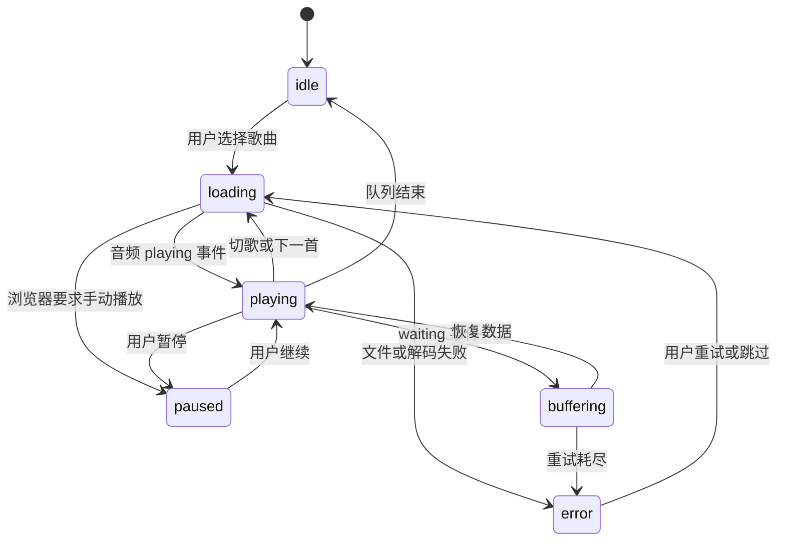

# LiteBeat 产品定位与前端体验规划

> 日期：2026-09-17｜阶段：立项规划｜工作目录：`D:\LiteBeat`
>
> 本文回答“为谁做、第一版做到什么程度、页面如何展示”。技术约束见 [技术架构与性能设计](./02-architecture-and-performance.md)，任务顺序与验收见 [实施路线与验收计划](./03-delivery-and-validation.md)。三份文件构成同一方案，而非三个独立项目。

## 1. 项目结论

LiteBeat 定位为**可以部署在个人电脑、小型服务器或 NAS 上的轻量音乐 Web 平台**。用户在浏览器中管理和播放自己的音乐库，桌面端与移动端共用一个响应式前端。

采用 **Rust + Axum + SQLite + Svelte 5 + TypeScript + Vite**。优先保证连续播放、快速检索和资源使用可控，再增加展示效果与扩展功能。“最小内存”作为持续优化方向，不能在没有真实实现和对照测试时宣称达到所有技术方案中的绝对最低。

第一版目标体验：启动服务 → 配置音乐目录 → 扫描入库 → 打开网页 → 搜索或浏览 → 播放、拖动进度、建立歌单。运行时只有一个应用服务进程和浏览器，数据库嵌入应用；构建工具不进入生产运行链路。

## 2. 已知要求与规划假设

### 2.1 用户已明确的要求

| 要求 | 规划响应 |
|---|---|
| 在当前文件夹开展项目 | 三份规划直接保存在项目根目录；后续源码在同一目录组织 |
| 音乐平台，包含 Web 与前端展示 | 覆盖媒体 API、音乐库、完整播放器和响应式页面 |
| 内存占用尽可能小 | 前后端分别设预算，所有长期增长的数据结构必须有容量边界 |
| 高性能 | 验证首播、拖动、列表查询、搜索和并发播放，而非只测空接口 |
| 语言和生态自行决定 | 给出确定的推荐技术栈，并说明取舍 |
| 生成 2–3 份不同层面的详细 Markdown 计划 | 本次交付三份规划；其中的应用功能与性能仍待实施、测量 |

### 2.2 已确认的音乐来源与其他默认假设

用户已确认采用自托管音乐库，扫描本机或服务器上的音乐文件。除音乐来源之外，下表其他内容是用于形成可执行方案的默认假设，不是已经获得确认的新增要求。

| 维度 | 第一版默认值 | 假设变化的影响 |
|---|---|---|
| 音乐来源（已确认） | 扫描管理员配置的本地或挂载目录 | 官方音乐 API 需要新增授权、内容适配与服务配额设计 |
| 使用方式 | 自托管、私人音乐库 | 公开运营需要独立重做容量、账号、上传和内容运营规划 |
| 账号 | 一个管理员账号，多设备会话；保留数据所有者字段 | 邀请制多用户放入后续版本 |
| 常见规模 | 1 万首；用 10 万首验证容量边界 | 超过 10 万首先测索引、磁盘和查询，再讨论架构升级 |
| 并发场景 | 日常 1–5 路；以 20 路原文件播放作为标准压力场景 | 实际人数与 HTTP 并发连接数不同 |
| 运行环境 | Windows 开发与桌面部署；Linux x86_64 为性能基准 | Linux ARM64/NAS 为后续发布目标，单独测试 |
| 网络 | 本机或受信任局域网；远程访问使用 HTTPS | TLS 终止进程的资源单独列账并纳入部署总量 |
| 音频策略 | 浏览器原生解码，后端直接传输文件 | 不兼容格式通过离线生成兼容副本解决 |
| 展示定位 | 应用型音乐库，搜索引擎收录不是第一版目标 | 公开内容页需要重新评估静态生成或 SSR |

## 3. 方案选择

| 方案 | 优点 | 代价 | 结论 |
|---|---|---|---|
| Rust + Axum + SQLite + Svelte | 能明确控制缓冲、生命周期和并发；前端静态发布；部署部件少 | Rust 的异步与所有权设计要求较高，需要认真处理流与数据库隔离 | **采用**，符合资源占用优先的项目目标 |
| Go + 标准 HTTP/轻量路由 + SQLite + Svelte | 后端开发与维护门槛较低，部署直接 | 需要结合垃圾回收和真实负载调节内存，不能把运行时内存限制当进程硬上限 | 如果后续团队更熟悉 Go，可基于同一基准重新比较 |
| TypeScript + Node.js + SQLite + Svelte | 前后端语言统一，上手与共享类型方便 | 常驻 JavaScript 运行时、依赖选择与后台任务控制需要额外关注 | 适合交付速度优先时选择，本项目暂不采用 |

这是针对本项目约束的工程判断，不是跨语言性能排名。Rust 官方介绍了其无垃圾回收运行时的特性；Go 官方也明确讨论了 GC、内存限制与物理内存的区别。[Rust 官方说明](https://rust-lang.org/)、[Go GC 指南](https://go.dev/doc/gc-guide)。

## 4. 产品目标与功能边界

### 4.1 核心使用场景

1. **个人日常听歌**：打开网页，继续最近播放的歌曲，切换页面时音乐不中断。
2. **大音乐库检索**：输入歌曲、歌手或专辑名称，在明确的搜索规则下快速定位。
3. **收藏与整理**：收藏歌曲，建立有顺序的歌单，在不同设备登录后看到持久化结果。
4. **手机访问家庭音乐库**：在窄屏中完成检索、播放、切歌和队列操作。
5. **管理员维护**：扫描新增文件，查看失败记录，备份数据库，恢复服务。

### 4.2 版本范围

| 优先级 | 功能 | 具体完成标准 |
|---|---|---|
| P0 | 初始化与登录 | CLI 创建管理员；无默认密码；登录、退出、会话过期体验完整 |
| P0 | 音乐目录扫描 | 配置目录、手动启动扫描、查看进度；支持增量更新与单文件失败报告 |
| P0 | 音乐库展示 | 歌曲分页、专辑列表、专辑详情、歌手名称过滤；字段缺失时有稳定占位 |
| P0 | 搜索 | 支持标题、歌手、专辑；中文短查询规则可见；空结果不显示假数据 |
| P0 | 全局播放器 | 播放/暂停、上一首/下一首、进度拖动、音量、顺序/随机/单曲循环 |
| P0 | 播放队列 | 加入队列、下一首播放、移除、清空；刷新后恢复队列但不自动发声 |
| P0 | 收藏与歌单 | 收藏开关；歌单创建、重命名、删除、添加/移除歌曲、调整顺序 |
| P0 | 最近播放 | 服务端持久化；按会话事件去重；只保留规定数量 |
| P0 | 响应式与可访问性 | 桌面/移动端可用；键盘可操作；控件有名称和焦点状态 |
| P0 | 基本运维 | 配置说明、健康检查、结构化日志、备份与恢复演练 |
| P1 | 封面缩略图 | 从有限大小的目录图片生成缩略图；按需加载；异常图片使用默认封面 |
| P1 | LRC 歌词 | 读取同目录同名 LRC；播放时高亮当前行；无歌词时保持完整播放器 |
| P1 | 媒体键/锁屏信息 | 对支持的平台启用 Media Session；不支持时基础播放正常 |
| P1 | 离线兼容副本 | 管理员显式运行转码任务，保留原文件；不会因点击播放自动启动转码 |
| P2 | 邀请制多用户 | 独立收藏、歌单与历史；验证资源所有权隔离 |
| P2 | PWA 应用外壳 | 安装入口、静态外壳缓存；音频离线下载另立容量与清理规则 |
| P2 | 官方来源适配 | 在具备官方播放能力和账号授权时增加来源适配器 |

P0 构成可发布 MVP。P1 逐项通过性能验收后加入。公开注册、评论社区、推荐模型、实时转码、桌面壳、全库离线缓存不列入当前 MVP 工期。

## 5. 页面与信息架构

| 路由 | 页面内容 | 首次数据量 | 用户主要动作 |
|---|---|---|---|
| `/login` | 品牌标识、账号、密码、错误反馈 | 会话状态一次 | 登录 |
| `/` | 最近播放、最近入库、收藏入口 | 最近播放 12 首、最近入库 12 首 | 继续听、进入音乐库 |
| `/library` | 歌曲列表、排序、过滤 | 默认 50 首 | 播放、收藏、加入歌单 |
| `/albums` | 专辑网格 | 默认 24 张 | 打开专辑 |
| `/albums/:id` | 专辑头部、曲目列表 | 曲目默认 50 首 | 播放专辑、选择曲目 |
| `/search?q=...` | 搜索框、结果和规则提示 | 默认 50 条 | 搜索与播放 |
| `/favorites` | 收藏列表 | 默认 50 首 | 播放、取消收藏 |
| `/playlists` | 歌单列表、创建入口 | 默认 24 个 | 创建、进入歌单 |
| `/playlists/:id` | 歌单描述、曲目与编辑动作 | 默认 50 首 | 播放、修改、排序 |
| `/settings` | 扫描状态、媒体目录说明、界面偏好 | 状态摘要 | 启动扫描、切换主题、查看错误 |

播放器位于应用根布局，不随路由卸载。队列使用侧栏或抽屉。没有登录的访问进入登录页，成功后返回原页面；不存在的资源显示可返回的错误页。

### 5.1 桌面布局

```text
┌──────────────────────────────────────────────────────────────────┐
│ LiteBeat             搜索歌曲 / 歌手 / 专辑             账号入口   │
├──────────────┬──────────────────────────────────────┬──────────────┤
│ 首页         │ 页面标题、过滤器                     │ 播放队列     │
│ 音乐库       │                                      │ 默认收起     │
│ 专辑         │ 歌曲表格 / 专辑网格 / 歌单详情        │              │
│ 收藏         │                                      │              │
│ 我的歌单     │ 分页控制与加载状态                   │              │
│ 设置         │                                      │              │
├──────────────┴──────────────────────────────────────┴──────────────┤
│ 封面 歌名/歌手     上一首 播放 下一首  进度/时长    音量 模式 队列 │
└──────────────────────────────────────────────────────────────────┘
```

大于等于 1024px 展示约 208px 的导航栏；播放器高度约 80px。队列展开时宽约 320px，主内容不足时改为覆盖式抽屉。长标题截断显示，详情或可访问名称保留完整文本。

### 5.2 移动布局

小于 768px 使用单列页面；底部依次是迷你播放器和导航。导航保留首页、音乐库、搜索、我的。点击迷你播放器打开完整播放页，提供大封面、进度、模式和队列。768–1023px 使用窄导航与自适应内容区。

触控目标至少 44×44 CSS px；适配屏幕安全区域。横屏与软键盘出现时，不让固定播放器遮挡搜索结果或提交按钮。首次点击播放只处理当前曲目，不预加载整张专辑。

## 6. 前端视觉与组件设计

### 6.1 视觉方向

采用简洁的深色音乐应用风格，兼容浅色主题。封面和内容形成视觉重点，减少持续动画、透明叠层、大面积模糊与不必要装饰。

| 项目 | 初始设计值 |
|---|---|
| 深色背景/面板 | `#101418` / `#192129` |
| 主文字/次文字 | `#F3F6F8` / `#AAB6C2` |
| 主色 | `#42D3AD`，用于播放、当前状态与交互强调 |
| 错误色 | `#FF7D87`，配合文字和图标，不能只靠颜色表达 |
| 字体 | 操作系统中文与拉丁字体栈；默认不下载 Web 字体 |
| 间距 | 4 / 8 / 12 / 16 / 24 / 32px |
| 圆角 | 控件 8px，卡片 12px |
| 图标 | 按需内联 SVG；优先复用小型图标集合中的必需图标 |
| 动效 | 120–180ms 的状态过渡；尊重减少动态效果设置 |

这些值是设计起点，最终颜色组合要在正常、悬停、禁用、焦点状态下验证文字对比度。第一版自己组织基础组件，不引入覆盖大量未用组件的 UI 套件。

### 6.2 组件边界

| 组件 | 职责 | 资源约束 |
|---|---|---|
| `AppShell` | 导航、路由容器、全局播放器位置 | 只建立一个音频元素 |
| `TrackList` | 展示一页歌曲、选择与菜单 | 默认分页；超过 200 行的展示场景才启用虚拟列表 |
| `AlbumGrid` | 专辑卡片和响应式列数 | 图片懒加载，不保留无限页 |
| `PlayerBar` / `PlayerSheet` | 两种布局共享同一个播放器状态 | 不各自创建播放器或计时器 |
| `QueueDrawer` | 当前队列和编辑操作 | 最多 1000 个曲目 ID，最多缓存 100 首详情 |
| `SearchBox` | 输入、输入法组合状态、请求取消 | 250ms 防抖；一个有效在途查询 |
| `CoverImage` | 缩略图与失败占位 | 列表不请求原始大图 |
| `StatusPanel` | 空库、加载、失败与重试 | 不因错误触发无限请求 |

Svelte 采用编译方式构建组件，适合本项目的轻量客户端目标；具体产物和内存仍由本应用构建结果决定。[Svelte 官方介绍](https://svelte.dev/)。

## 7. 播放行为与异常处理

### 7.1 状态契约



- 切歌使用递增的播放请求编号，旧请求和旧事件不能覆盖当前曲目。
- 切换页面、打开队列和编辑歌单不打断播放；退出登录会停止并清除受保护播放状态。
- 更新进度依据音频事件；仅播放且页面可见时平滑刷新，文本时间至多每秒更新一次。
- 网络错误最多自动重试 2 次，退避 1s、3s，优先尝试恢复原位置；手动切歌立即取消旧重试。
- 连续遇到 3 首不可播放曲目后停止自动跳过，明确显示失败原因，避免空队列循环。
- 初次加载、刷新恢复和会话重新登录不自动发声；捕获 `play()` 拒绝并显示播放按钮。
- 队列采用设备本地状态；歌单、收藏、历史保存在服务端。第一版不做实时跨设备队列同步。
- “播放全部”按服务端稳定顺序取得最多 1000 个 ID；超过时明确提示当前加入数量，不下载全部曲目详情。

原生 `<audio>` 负责解码。`preload="metadata"` 只表达预加载建议，不能保证浏览器缓冲固定为某个大小；音频格式支持也依浏览器与操作系统而异。[MDN audio 文档](https://developer.mozilla.org/en-US/docs/Web/HTML/Reference/Elements/audio)。

### 7.2 明确的边界反馈

| 情况 | 页面表现 | 后续动作 |
|---|---|---|
| 音乐库为空 | 说明尚未扫描到音乐 | 管理员进入设置启动扫描 |
| 缺失标题/专辑/歌手 | 标题回退文件名；专辑和歌手使用“未知” | 不阻塞导入和播放 |
| 缺失封面或歌词 | 默认封面；“暂无歌词” | 不反复请求缺失资源 |
| 文件在磁盘上消失 | 曲目标为不可用 | 提供重新扫描，不删除歌单结构 |
| 不支持的编码 | “当前浏览器无法播放此格式” | P1 可选择已有兼容副本 |
| 会话失效 | 保留当前页面导航位置，提示重新登录 | 新媒体请求停止；正在传输的流见架构中的会话策略 |
| 服务器忙 | 显示稍后重试，遵循服务端重试间隔 | 禁止前端无限轮询 |
| 一两个汉字查询 | 提示当前使用名称前缀匹配 | 三个及以上字符支持片段匹配 |

## 8. 性能目标与体验预算

以下全部是**验收目标，尚未测量**。基准环境、负载与测量口径以第三份文件为准。

| 指标 | 第一版目标 |
|---|---|
| 后端空库启动稳定后的 RSS | ≤24 MiB |
| 10 万首库完成登录和浏览后，空闲 5 分钟的 RSS | ≤48 MiB |
| 20 路 320 kbit/s 原文件播放与普通 API 混合负载的后端 RSS 峰值 | ≤96 MiB |
| 扫描或登录等维护场景的后端 RSS 峰值 | ≤160 MiB |
| 应用部署 cgroup 的内存 | 标准播放负载下 `memory.current` ≤256 MiB；含页缓存与同组代理 |
| 前端首屏加载的 JS 合计 | gzip 后 ≤80 KiB；包括立即加载的依赖块 |
| 前端初始 CSS | gzip 后 ≤20 KiB |
| 首页初次传输 | ≤300 KiB，不含用户点击后播放的音频 |
| 前端 JS 堆 | 浏览并播放 30 分钟后 ≤40 MiB；单独记录浏览器进程内存 |
| 普通列表 API | 20 路播放背景下，50 RPS 混合 API，p95 ≤100ms |
| 搜索 API | 同场景，p95 ≤200ms |
| 首次播放 / 拖动恢复 | 规定局域网场景 p95 ≤800ms / ≤500ms |
| 首页 LCP / CLS | 规定移动端模拟场景 ≤2s / ≤0.1 |

不把浏览器总内存等同 JS 堆，不把应用 RSS 等同整机占用，不把平均延迟等同尾延迟。若指标冲突，优先排除无界增长和播放失败，再衡量内存与响应速度的取舍。

## 9. 用户故事与产品验收

| 编号 | 用户故事 | 验收证据 |
|---|---|---|
| U01 | 我能把已有音乐目录变成可浏览的音乐库 | 正常、缺标签、损坏文件混合扫描；展示成功/失败统计 |
| U02 | 我能在十万首歌曲中找到目标 | 中英文、短查询、特殊字符、无结果的搜索记录 |
| U03 | 我能边浏览边听歌 | 连续导航 50 次，音频元素始终只有一个，播放不中断 |
| U04 | 我能拖到歌曲中间继续听 | 实际浏览器拖动测试和对应 HTTP Range 日志 |
| U05 | 我能建立并保存自己的歌单 | 建立、排序、刷新、重启后恢复；并发修改显示冲突 |
| U06 | 我能在手机上完成主要操作 | 窄屏、横屏、触控、键盘及屏幕阅读器检查记录 |
| U07 | 我能理解为什么某首歌无法播放 | 缺文件、不支持编码、网络断开三类明确反馈 |
| U08 | 我可以长期运行而不用频繁重启 | 8 小时混合运行测试，内存无持续上涨、无资源泄漏 |

## 10. 后续范围变化的处理方式

如果改为**官方在线音乐服务**，先验证官方 API 是否提供完整音频播放、授权方式与设备限制；统一曲目展示并不代表不同服务的音频可以由自建后端自由转发。来源字段、授权信息与播放器适配器另设设计，不预先实现无需求的插件系统。

如果改为**公开上传与运营**，新增上传配额、文件隔离处理、内容来源记录、用户权限、对象存储、流量预算与管理流程。它将成为独立阶段，不能沿用本文件的私人音乐库容量和工期承诺。

如果改为**展示首页优先**，先实现有真实 API 的音乐库和播放器闭环，再增加专题页、编辑推荐或公开专辑页。所有展示模块仍遵守首屏资源预算。

## 11. 阅读与执行顺序

1. 阅读本文，确定产品边界与用户体验。
2. 阅读 [技术架构与性能设计](./02-architecture-and-performance.md)，按契约划分模块和数据流。
3. 按 [实施路线与验收计划](./03-delivery-and-validation.md) 从最小可播放闭环开始，逐阶段记录真实测量结果。
