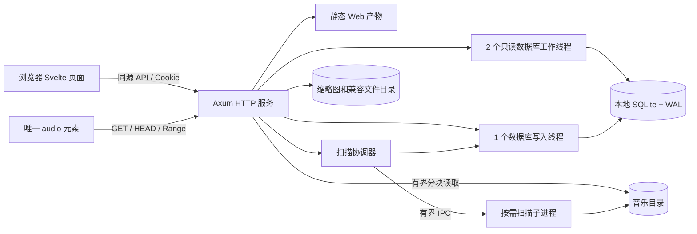

# LiteBeat 技术架构与性能设计

> 日期：2026-09-17｜状态：设计方案，尚未实施或压测
>
> 产品范围见 [产品与前端体验](./01-product-and-experience.md)，执行任务及验证方法见 [实施路线与验收](./03-delivery-and-validation.md)。用户已确认音乐来源为扫描本机或服务器文件的自托管音乐库。

## 1. 架构决策

采用**模块化单体后端 + 静态 Web 前端 + 嵌入式数据库 + 文件系统媒体库**。把内存开销花在正在使用的数据上，避免音乐文件、全库元数据、全部封面和全量搜索结果常驻应用内存。

### 1.1 技术栈

| 层面 | 选择 | 职责与取舍 |
|---|---|---|
| 后端语言 | Rust stable，edition 2024 | 编译为本地程序，控制对象生命周期和数据复制 |
| HTTP | Axum + Tokio + Tower / tower-http | 路由、异步网络、超时与文件响应；只启用需要的 features |
| 数据访问 | rusqlite + bundled SQLite | 显式 SQL、迁移、事务；数据库版本随发布锁定 |
| 搜索 | SQLite FTS5 trigram + 名称前缀索引 | 支持片段搜索；短查询有独立规则 |
| 媒体元数据 | Lofty，运行在受限扫描子进程 | 读取标签与时长；关闭默认不需要的图片读取 |
| 前端 | Svelte 5 + TypeScript | 小组件、局部更新、类型化请求 |
| 前端构建 | Vite + npm 锁文件 | 生成静态文件；Node.js 只用于开发、构建与测试 |
| 播放 | 一个原生 HTMLAudioElement | 浏览器解码，不把整首音频读入 JS |
| 身份认证 | Cookie 会话 + Argon2id | 音频与 API 同源；不要求音频元素附带自定义认证头 |
| 日志 | tracing，滚动文件或标准输出 | 有界记录；日志不打印密码、Cookie、完整本地路径 |
| 测试 | Rust 集成测试、Vitest、Playwright、独立负载脚本 | 正确性、真实浏览器行为与资源测量分开 |
| 可选处理 | 离线 FFmpeg、受限图片解码 | P1 引入；不增加常驻转码服务 |

本轮核对的接口参考为 Axum 0.8 系列、tower-http 0.7 系列与 Svelte 5 文档。正式开发的 T01 必须选择当时相互兼容的稳定补丁版本，提交 `rust-toolchain.toml`、`Cargo.lock`、`package-lock.json`，记录 Node.js 版本及 SQLite 编译选项；CI 使用锁文件，不在生产启动时自动更新依赖。

选型依据：[Axum 中间件](https://docs.rs/axum/latest/axum/middleware/)、[rusqlite](https://docs.rs/rusqlite/latest/rusqlite/)、[Vite 静态部署](https://vite.dev/guide/static-deploy.html)。这些资料证明能力与接口，不证明本项目已经达到性能目标。

### 1.2 部署与数据流



日常播放只有一个应用服务进程。扫描时额外启动一个临时子进程，完成或停止任务后退出；必须计入进程树和 cgroup 的内存，不能通过拆进程隐藏开销。媒体文件只读；数据库、缓存、日志写入独立的数据目录。

默认绑定 `127.0.0.1:8090`；局域网访问由管理员明确修改监听地址。生产直接由应用提供 `web/dist` 的构建产物。可使用现有反向代理终止 HTTPS，代理内存单独记录并计入整套部署。开发模式下 Vite 代理 `/api` 和 `/media` 到后端。

## 2. 模块边界与建议目录

以下为后续创建的源码结构，不表示文件已经存在。

```text
LiteBeat/
  01-product-and-experience.md
  02-architecture-and-performance.md
  03-delivery-and-validation.md
  Cargo.toml / Cargo.lock / rust-toolchain.toml
  server/
    Cargo.toml
    src/
      main.rs                 # CLI 入口、运行时和退出信号
      lib.rs                  # 可测试的应用构建入口
      config.rs               # 配置读取与边界验证
      error.rs                # API 错误与状态码
      http.rs                 # 路由、连接限制、静态文件
      auth/                   # 密码、会话、CSRF、限流
      db/                     # 迁移、工作线程、读写队列
      library/                # 曲目、专辑、分页、搜索
      scanner/                # 遍历、增量判定、子进程协议
      media/                  # 安全路径、Range、流生命周期
      playlists/              # 收藏、歌单及并发版本控制
      history/                # 播放事件、去重、保留上限
      maintenance/            # 备份、恢复、清理、状态
    migrations/
    tests/
  web/
    package.json / package-lock.json
    src/
      App.svelte
      lib/api.ts / lib/contracts.ts / lib/router.ts
      lib/player/             # 音频引擎、队列、状态
      lib/components/         # 基础控件和可复用展示
      routes/                 # 页面，按路由拆分加载
      styles/
    tests/
  e2e/
  fixtures/                   # 自生成或可再分发的测试媒体
  scripts/                    # 构建检查、造数、负载和采样
  deploy/                     # Linux 服务、可选容器、Windows 启动说明
  config/litebeat.example.toml
```

模块通过明确的查询、命令和 DTO 交互。HTTP 层不直接执行同步 SQLite 查询，播放器组件不直接维护另一套音频状态。先使用一个后端 crate；出现明确复用需求后才拆工作区子 crate。

## 3. 内存预算与负载上限

### 3.1 测量口径

- **进程 RSS**：操作系统报告的驻留内存，包含堆、实际驻留栈和映射页；VSS 不能替代 RSS。
- **进程树**：主服务与扫描子进程分别记录；RSS 相加可能重复计入共享页，Linux 可补充 PSS。
- **cgroup 内存**：记录 `memory.current` 与 `memory.stat`，包括归属该组的文件页缓存、内核开销和子进程；它不等于进程 RSS。
- **浏览器**：记录 JS 堆、DOM 数量和浏览器任务管理器内存；媒体解码、图片、GPU 与浏览器自身开销不完全出现在 JS 堆中。
- **开发与构建**：Rust 编译、Vite dev server、测试进程的资源与生产占用分开报告。

### 3.2 预算表

| 资源 | 初始设置 | 说明 |
|---|---|---|
| Tokio worker | 2 个 | 适配标准 2 vCPU 基准，避免随宿主核心数无限扩大 |
| Tokio blocking pool | 最大 4 个 | 文件操作共享；限制线程数量不等于限制等待任务数量 |
| SQLite | 2 个读连接 + 1 个写连接 | 每连接页缓存建议值约 2 MiB，总建议值约 6 MiB |
| 数据库读队列 | 每读线程 32 个 | `try_send`，队满返回可重试的忙碌响应 |
| 数据库写队列 | 64 个，合计载荷 ≤4 MiB | 命令对象不可夹带音频、图片或整库数据 |
| 全局普通 API | 32 个在途请求 | 超额立即返回 503 + `Retry-After` |
| 全局媒体响应 | 32 个响应体 | 每会话最多 4 个；配额保持到响应体完成或被丢弃 |
| 单媒体读取块 | 32 KiB | 20 路约 640 KiB 的一层应用缓冲；网络和库内部开销另算 |
| HTTP 连接 | 128 个 | 空闲连接 30s；请求头读取 5s、大小上限 16 KiB |
| JSON 请求体 | ≤64 KiB | 超限返回 413；不对音频响应应用这个限制 |
| 列表分页 | 默认 50，最大 100 | 专辑网格默认 24；所有输入上限在后端校验 |
| 元数据 LRU | 默认关闭，必要时最多 4 MiB / 2000 条 | 先证明 DB 查询是瓶颈再开启；更新有失效机制 |
| 日志发送队列 | ≤1 MiB | 拥塞时丢弃低等级日志并累计计数，不阻塞播放 |
| 扫描 | 同时 1 个任务、1 个解析子进程 | 输入队列 ≤64 项 / 1 MiB；结果单条 ≤32 KiB |
| 密码校验 | 同时 1 个，排队最多 2 个 | Argon2id 初始参数 m=32 MiB、t=3、p=1，保留安全成本 |
| 前端结果缓存 | 3 页，每页最多 100 条 | 路由离开释放旧页；请求使用 AbortController |
| 播放队列 | 最多 1000 个 ID | 详情缓存最多 100 首；持久化状态目标 ≤256 KiB |

目标沿用第一份文件：空库 RSS ≤24 MiB；使用后的空闲 RSS ≤48 MiB；20 路混合负载 RSS 峰值 ≤96 MiB；维护场景主进程 RSS 峰值 ≤160 MiB。扫描子进程独立上限初设 96 MiB；标准播放场景应用部署 `memory.current` ≤256 MiB。

这些分项不能简单相加后宣称得到真实 RSS。TLS、分配器保留、依赖内部缓冲、线程栈和数据库语句都有额外成本。硬限制属于故障保护，达标必须依赖实际采样。Linux 发布配置以 `MemoryMax=256M`、无交换空间作为标准播放验证档；扫描的整体峰值也必须单独报告。

连接和请求头限制在 HTTP 服务构建层落实：使用显式 accept 循环及 Hyper/hyper-util 的连接配置，不能仅配置路由中间件。应用初版仅开放 HTTP/1.1 上游；代理可以向浏览器提供 HTTP/2，未来直连 HTTP/2 时另设并发流上限。Axum 的便捷 `serve` 接口本身不提供完整连接参数配置。[Axum serve](https://docs.rs/axum/latest/axum/fn.serve.html)。

Tokio 的阻塞任务可能在线程上限之外继续排队，已经开始的阻塞操作也不能靠取消异步句柄直接终止。因此业务入口先限流、数据库使用专用线程、解析使用可终止子进程。[Tokio spawn_blocking 文档](https://docs.rs/tokio/latest/tokio/task/fn.spawn_blocking.html)。

## 4. 数据存储与查询

### 4.1 核心表契约

ID 在数据库中使用 INTEGER 主键；API 中统一序列化为十进制字符串，避免 JavaScript 大整数精度问题。时间在 API 中使用 UTC RFC 3339 字符串；时长和播放位置使用整数毫秒；文件大小在 API 中也使用十进制字符串。

| 表 | 核心字段 | 约束与索引 |
|---|---|---|
| `users` | id、username、password_hash、created_at | username 唯一；第一版只允许 CLI 创建管理员 |
| `sessions` | token_hash、user_id、csrf_token、expires_at | 原始会话令牌不入库；CSRF 令牌供同源会话接口读取；按到期时间清理；最多 64 个活动会话 |
| `library_roots` | id、name、canonical_path、enabled | 配置文件给出目录，API 不接受任意磁盘路径 |
| `albums` | id、root_id、directory_key、title、album_artist、sort_title | 同目录同专辑身份去重；不把所有同名专辑自动合并 |
| `tracks` | id、root_id、relative_path、title、artist、album_id、album_title、duration_ms、codec、mime、size_bytes、mtime_ns、sort_title、sort_artist、sort_album、disc_no、track_no、available、last_seen_scan_id | `(root_id, relative_path)` 唯一；排序索引含 id；播放只取需要字段 |
| `tracks_fts` | sort_title、sort_artist、sort_album，映射 tracks.id | FTS5 trigram；索引规范化字段；外部内容表；更新和删除与 tracks 同事务 |
| `favorites` | user_id、track_id、created_at | `(user_id, track_id)` 唯一 |
| `playlists` | id、owner_id、name、version、updated_at | 用户所有权索引；版本号用于并发修改检测 |
| `playlist_items` | id、playlist_id、track_id、position | 同一首可重复出现；按 position/id 排序；最多 1000 条 |
| `play_history` | id、user_id、track_id、event_id、played_at | `(user_id,event_id)` 唯一；每用户最多 500 条 |
| `scan_jobs` | id、root_id、state、scanned、updated、failed、started_at、finished_at | 一次只运行一个；重启后 running → interrupted；保留最近 20 个结束任务及其错误明细 |
| `scan_errors` | job_id、relative_path、code | 每次扫描保留最多 1000 条明细，另记全部失败数量 |
| `request_dedup` | user_id、key、method、path、request_hash、response_json、expires_at | 创建类写操作幂等，24h 过期；最多 10000 条，满后拒绝新的非幂等写入 |
| `media_assets`（P1） | id、track_id/album_id、kind、relative_path、source_revision、size_bytes | 保存封面、歌词和兼容副本索引，二进制不入库 |

MVP 使用曲目中的歌手文本展示和过滤，不把合作歌手按逗号强行拆成错误身份；独立歌手实体、别名和多歌手关系留待需求明确后迁移。

### 4.2 SQLite 配置

```sql
-- 初始化写连接时启用；检查返回值确实为 wal。
PRAGMA journal_mode = WAL;

-- 每个连接分别设置并读取验证。
PRAGMA foreign_keys = ON;
PRAGMA cache_size = -2048;
PRAGMA mmap_size = 0;
PRAGMA temp_store = FILE;
PRAGMA busy_timeout = 1000;
PRAGMA synchronous = FULL;

-- 写连接的初始检查点设置。
PRAGMA wal_autocheckpoint = 1000;
```

`cache_size` 是页缓存建议上限，不是 SQLite 总内存硬限制；`mmap_size=0` 关闭该连接的内存映射读取。使用 `FULL` 优先保障收藏与歌单写入的持久性，若考虑改为 `NORMAL`，必须单独说明掉电事务持久性取舍并重新测试。[SQLite PRAGMA](https://sqlite.org/pragma.html)。

写连接串行执行短事务，扫描按最多 100 条或 100ms 的批次提交，以先达到者为准。普通查询设 200ms 的执行预算，超出时通过 SQLite progress handler 中断，转换为 `QUERY_TIMEOUT`；不能仅让 HTTP 超时而留下失控 SQL。

定时检查 WAL 文件大小，超过 64 MiB 时暂停扫描写入、检查长读事务并尝试被动检查点；不要在播放高峰强制阻塞式清理。所有查询完成立即结束读事务。SQLite 数据库放本地盘，音乐文件可以在挂载盘；WAL 模式的跨机器共享限制不适合把数据库直接放网络共享上。[SQLite WAL](https://sqlite.org/wal.html)。

### 4.3 分页、排序与搜索

- 歌曲按 `(sort_title,id)`，最近入库按 `(id)`，专辑曲目按 `(disc_no,track_no,id)`，歌单按 `(position,id)` 使用游标分页。
- 游标携带排序键、过滤器摘要及版本，限制为 512 字节；参数化解码查询，非法游标返回 400，不能直接拼接 SQL。
- 浏览采用读已提交语义，扫描期间可能看到新数据；不宣称跨多次翻页是同一个数据库快照。歌单分页绑定 version，冲突要求刷新。
- 全库搜索输入先 NFKC 规范化、去除首尾空白、统一 ASCII 大小写，最多 64 个 Unicode 字符；规范化字段与查询使用同一函数。
- 1–2 个字符：标题、歌手、专辑名称的**前缀匹配**，使用对应普通索引。产品提示规则，不把前缀结果伪装为任意子串结果。
- 短查询使用预先转义并绑定的 `LIKE 前缀% ESCAPE '\'`，三个规范化字段建立 `COLLATE NOCASE` 索引，排序和游标比较使用同一 collation。保持 SQLite 内建 LIKE 语义，不覆盖其函数；实际是否使用索引由查询计划验证。[SQLite LIKE 索引条件](https://sqlite.org/optoverview.html#the_like_optimization)。
- 3 个及以上字符：使用 FTS5 trigram 的字面短语匹配，参数绑定前正确转义双引号；不直接把用户文本作为 FTS 表达式执行。
- 搜索固定按 `(sort_title,id)` 展示，结果只返回一页，不计算高成本全量总数；返回 `has_more` 和 `next_cursor`。
- `%`、`_`、引号和反斜杠作为普通用户字符处理；含特殊字符的查询必须有测试，不为获得索引优化牺牲语义正确性。
- 首版不加入拼音、同义词、模糊纠错和相关性排序。需要时分别评估索引体积与延迟。

FTS5 trigram 对少于 3 个 Unicode 字符的全文查询有限制，短查询必须走另一条路径；外部内容 FTS 索引也需要应用维护一致性。[SQLite FTS5](https://sqlite.org/fts5.html)。

## 5. 扫描、元数据与媒体文件

### 5.1 增量扫描流程

1. 从配置中的根目录启动任务，确认目录可访问；同一时间第二个扫描请求返回 409 并给出已有任务 ID。
2. 惰性遍历目录，不先收集十万条路径。目录层级上限 64；默认不跟随符号链接或 Windows reparse point；忽略数据目录、临时文件和隐藏缓存目录。
3. 以 `(root_id,relative_path,size_bytes,mtime_ns)` 判定变化。未变化文件只更新本次扫描标记；相同大小和时间戳的内容替换可通过“强制重新读取标签”修复。
4. 需要解析的文件逐个交给 `litebeat scan-worker`，每次只有一个在途文件。标准模式只读取标签和属性，不解码音频。
5. 子进程输出有界 JSON 行；单个文本字段最多 1024 字符、累计元数据最多 16 KiB，超过时截断并记录警告。损坏、超时或越界文件记入错误表。
6. 协调器验证结果并交给数据库写线程，短事务更新 tracks、albums 和 FTS；不为每首曲目启动数据库连接。
7. **仅当整个根目录遍历成功完成时**，把本次未见的曲目标记为 unavailable。目录断连或取消任务时不把整库误判为删除。
8. 标为不可用的曲目保留 ID、收藏和歌单关联，恢复同路径后重新可用。第一版跨目录移动视为新条目，不声称自动保留移动前身份。

解析超时初设每文件 5s；扫描子进程资源预算初设 96 MiB。Linux 使用子 cgroup 的内存限制，Windows 使用 Job Object 的提交内存限制；两者口径不同，另外采样实际 RSS。若限制能力不可用，显示状态且不得把该配置宣称为完成了隔离验收。超时、崩溃或超限时结束子进程，记下当前失败文件，重启后继续下一文件。Linux 整组内存达到 192 MiB 时暂停投递新解析工作，持续达到 224 MiB 时停止扫描并报告资源不足；256 MiB 硬限额只是最后保护，不能作为扫描成功的证明。

Lofty 提供解析选项，可按实际锁定版本关闭图片读取等不需要的工作；读取标签不等于只读取固定数量字节，因此必须保留进程边界和异常样本验证。[Lofty ParseOptions](https://docs.rs/lofty/latest/lofty/config/struct.ParseOptions.html)。

### 5.2 文件路径与访问边界

浏览器只提交 track ID，不能提交文件路径。服务端从数据库解析到受配置根目录约束的文件。检查路径组件、规范路径与根目录关系，拒绝穿越和链接逃逸；Unicode 路径必须在 Windows/Linux 测试。

以受信任管理员维护、普通 Web 用户不可写的音乐目录作为 MVP 的部署前提。规范化路径检查后重新按路径打开存在竞态，不能宣称单靠 `canonicalize` 就能抵抗恶意本地换链。如果目录允许不受信任进程修改，必须改用根目录句柄约束的打开方式并对同一文件句柄流式读取；在此之前不支持该部署模式。

服务端只读音乐目录，不自动改标签或删除原始音乐。若文件正在被外部替换，当前响应可能失败；前端给出重试，下一次扫描刷新元数据。

### 5.3 封面、歌词与转码

- P0 使用默认封面，避免扫描时对全库进行图片解码。
- P1 先支持同目录 `cover.jpg`、`folder.jpg`、`cover.png`；输入文件 ≤8 MiB、解码尺寸 ≤1600 万像素，越界跳过。解码在受限子进程中执行，不能只在解码后检查大小。
- 生成 96px 和 320px 缩略图，磁盘按源版本寻址，浏览器按展示尺寸选用。缓存配额初设 512 MiB，定期按访问记录清理；清理不得影响原图和音乐文件。
- P1 歌词读取同名 `.lrc`，文件 ≤256 KiB、≤5000 行，按时间戳解析，作为文本输出。第一版支持 UTF-8；其他编码明确显示不支持。
- 首选 MP3、AAC/M4A 的实际浏览器测试；FLAC、Ogg/Opus 等先探测再尝试播放。不把扩展名等同于编码兼容性。
- 离线转码使用独立 CLI、单任务执行，默认不在服务内自动启动。兼容副本建议 AAC-LC/M4A 192 kbit/s，浏览器实测确认；原文件保留，输出临时文件验证完成后原子替换。
- 转码是独立维护工作负载，初设额外内存预算 512 MiB，需单独测量。256 MiB 主服务验收不涵盖同时运行 FFmpeg；低内存设备可在其他机器预处理后导入。

## 6. 播放传输协议

### 6.1 请求流程

`GET /media/tracks/{id}` → 验证会话 → 查询可用曲目 → 取得流配额 → 校验并打开文件 → 按请求范围流式响应 → 断开/完成时释放文件与配额。

不要 `read_to_end`，不要将音频放入全局 Vec、Base64 或 JSON。首先使用 tower-http 的文件服务与 32 KiB 读取块，实现成熟的文件响应行为；这不等于操作系统零拷贝。只有证明确有收益并满足跨平台与鉴权要求后，再考虑平台专用传输优化。

建议配置示意：

```rust
use tower_http::services::ServeFile;

let service = ServeFile::new(validated_path)
    .with_buf_chunk_size(32 * 1024)
    .ignore_multi_range_requests(true);
```

示意中 `validated_path` 是鉴权及根目录检查后的服务端路径；流配额还必须由包装后的响应体持有。不能在 handler 返回响应头时提前释放配额。

### 6.2 HTTP 行为契约

| 请求情况 | 预期行为 |
|---|---|
| 无 Range 的 GET | 200、正确 Content-Type/Content-Length，分块读取文件 |
| 合法单范围 | 206，正确 Content-Range，返回精确字节区间 |
| `bytes=N-` / `bytes=-N` | 支持开放结束范围和后缀范围 |
| 不可满足或畸形的 Range | 416；单范围越界时给出 `Content-Range: bytes */总长度` |
| 语法有效的多范围 | 忽略 Range，返回 200 完整响应；不生成 multipart 巨大缓冲 |
| HEAD | 与完整 GET 一致的媒体元数据，响应体为空；Range 仅应用于 GET |
| 文件不存在或已不可用 | 404；不返回服务器路径 |
| 没有有效会话 | 401；媒体路由不返回 HTML 登录页 |
| 有 If-Range 但不能验证强校验条件 | 忽略 Range 返回 200；不能用弱 ETag 伪装强验证 |
| 用户中断下载 | 及时释放文件句柄、流许可及临时缓冲 |

文件服务支持配置读取块大小和忽略多范围请求，锁定版本后仍要用实际响应测试确认这些语义。[ServeFile](https://docs.rs/tower-http/latest/tower_http/services/struct.ServeFile.html)、[ServeDir 的多范围策略](https://docs.rs/tower-http/latest/tower_http/services/struct.ServeDir.html#method.ignore_multi_range_requests)。

媒体路由不启用 gzip/Brotli 二次压缩，不应用普通 API 的 3s 总超时。媒体采用 30s 无发送进展超时和客户端断开取消；长音乐文件本身不受 3s 限制。音频响应初始使用 `Cache-Control: private, no-store`，避免退出后跨会话 HTTP 缓存复用；浏览器当前解码与播放缓冲仍由浏览器管理。

## 7. API 契约

### 7.1 通用约定

所有业务 API 前缀 `/api/v1`，JSON 使用 snake_case。返回错误形如：

```json
{"error":{"code":"LIBRARY_BUSY","message":"音乐库正在处理请求，请稍后重试","request_id":"req-8d13"}}
```

常规状态码：400 参数错误、401 未登录、403 权限/CSRF 失败、404 不存在、409 扫描或版本冲突、413 请求过大、428 缺失写入版本条件、429 登录或会话级限流、503 服务忙。所有成功写入以数据库提交为准。歌单详情及修改结果返回版本 ETag，例如 `"playlist-12-v3"`；客户端在后续修改的 `If-Match` 中原样带回，缺失返回 428，不匹配返回 409。

分页响应示例：

```json
{
  "items": [{"id":"42","title":"示例曲目","artist":"示例歌手","album_id":"7","duration_ms":213000,"available":true}],
  "next_cursor":"opaque-cursor",
  "has_more":true
}
```

### 7.2 路由清单

| 方法与路径 | 用途 | 关键约束 |
|---|---|---|
| `GET /health/live`、`GET /health/ready` | 存活与数据库/迁移就绪状态 | 不泄露配置；ready 失败返回 503 |
| `POST /api/v1/auth/login` | 建立会话 | 仅接受 JSON；检查 Origin；限流后才校验密码 |
| `GET /api/v1/auth/session` | 当前账号及 CSRF 令牌 | `no-store`；原始会话令牌不进入 JSON |
| `POST /api/v1/auth/logout` | 撤销会话 | 检查 CSRF；清 Cookie |
| `GET /api/v1/tracks` | 歌曲分页、歌手过滤 | limit≤100；白名单排序 |
| `GET /api/v1/tracks/{id}` | 单曲详情 | 仅公开播放需要字段 |
| `GET /api/v1/albums`、`GET /api/v1/albums/{id}/tracks` | 专辑与曲目 | 游标分页 |
| `GET /api/v1/search` | 搜索 | q≤64 字符；短查询走前缀 |
| `GET /api/v1/queue-ids` | 按 scope 构建播放队列 | scope=library/album/favorites/playlist，最多 1000 ID，返回 truncated |
| `GET /api/v1/favorites` | 收藏分页 | 当前用户 |
| `PUT/DELETE /api/v1/favorites/{track_id}` | 收藏切换 | 幂等写入 |
| `GET/POST /api/v1/playlists` | 歌单列表/创建 | 名称 1–100 字符；创建使用 Idempotency-Key |
| `GET/PATCH/DELETE /api/v1/playlists/{id}` | 详情/重命名/删除 | owner 校验；修改需要 If-Match 版本 |
| `GET/POST /api/v1/playlists/{id}/items` | 曲目分页/追加 | 追加最多 100 条；Idempotency-Key；If-Match |
| `DELETE /api/v1/playlists/{id}/items/{item_id}` | 删除条目 | 按条目 ID，允许歌单内有重复歌曲 |
| `PUT /api/v1/playlists/{id}/order` | 重排歌单 | 最多 1000 个 item ID，必须与当前条目集合一致；If-Match |
| `GET/POST /api/v1/history` | 最近播放/播放事件 | event_id 去重；累计播放 30s 或短曲结束时上报 |
| `GET /api/v1/admin/status` | 目录、资源与最近扫描摘要 | 管理员可见；响应不带秘密 |
| `POST /api/v1/admin/scans` | 创建扫描 | root_id + force；Idempotency-Key；返回 202/job_id |
| `GET /api/v1/admin/scans/{id}` | 扫描状态与有界错误分页 | 运行时 2s 轮询，页面隐藏则停止 |
| `POST /api/v1/admin/scans/{id}/cancel` | 取消扫描 | 幂等，结束子进程，不标记缺失曲目 |
| `GET/HEAD /media/tracks/{id}` | 音频内容 | 同源 Cookie，Range，响应体配额 |
| `GET /media/covers/{id}`（P1） | 缩略图 | size=96/320，带版本 URL，仍需鉴权 |
| `GET /api/v1/tracks/{id}/lyrics`（P1） | 解析后的歌词 | 按行文本，禁止任意 HTML |

发生客户端超时，写任务可能已经提交；创建歌单、追加条目、启动扫描使用持久化幂等记录，键相同且载荷相同返回原结果，键相同但载荷不同返回 409。版本控制与幂等校验放在同一事务，先检查已完成幂等结果，再校验新的 If-Match，防止成功重试被误判冲突。

## 8. 身份认证与请求边界

- CLI `litebeat admin create` 交互输入密码，避免把密码写入命令行、示例配置或日志。Argon2id 使用独立随机盐，参数保存在哈希中。
- 会话令牌使用 32 字节安全随机数；数据库只存哈希。Cookie 使用 HttpOnly、SameSite=Lax、Path=/；HTTPS 部署启用 Secure。本机 HTTP 开发例外明确配置。
- 会话绝对有效期默认 7 天。每次请求检查有效期，不为每个音频 Range 请求写“最后访问时间”；退出后新请求立即无效。
- 第一版不在每个音频块查询会话。已经获准并开始发送的响应可继续到该响应结束；当前设备退出会停止播放器。需要强制踢下线的场景再增加有界的流取消表。
- 所有修改操作通过 `X-CSRF-Token` 请求头检查 CSRF 令牌，并检查 Origin；登录请求检查 Origin 与 JSON Content-Type。默认关闭跨域访问。
- 登录限流初设每 IP 5 次/分钟、每账号 10 次/10 分钟，并有全局密码校验并发限制；限流键表最多 1024 条且有 TTL，不让防护表本身无限增长。
- 曲目、歌单、收藏、历史与媒体端点逐一检查访问范围。即便第一版一个账号，也不省略歌单 owner 条件。
- 标题、标签、歌词只按文本渲染；设置 CSP、`X-Content-Type-Options: nosniff`，不从歌词注入 HTML。
- 外部可见错误不带数据库 SQL、密码哈希、真实路径或调用栈。配置与数据库文件不处于 Web 静态目录。

## 9. 前端内存与打包策略

1. 使用轻量 History API 路由，只有页面切换时挂载页面组件；深链接由服务端返回应用入口，`/api`、`/media` 和不存在的静态资源不回退为 HTML。
2. 页面按需加载；播放器与最小导航进入公共包；设置和管理页面独立 chunk。首屏 JS 统计必须包含立即请求的所有 chunk。
3. 不引入完整音乐 SDK、WebAssembly 解码器、波形分析库、全局深拷贝状态或整首音频 Blob。
4. 音频引擎是唯一实例；注册事件时同时定义卸载方法，切歌复用元素。重试计时器、路由订阅和页面请求都可取消。
5. 默认分页控制 DOM 数量；队列达到大量条目时使用窗口化显示，逻辑数据仍受 1000 ID 上限控制。
6. 图片使用固定尺寸、懒加载和有限预取；列表不请求 320px 以上封面，滑出列表的组件释放引用。
7. 搜索处理中文输入法 composition 事件，250ms 防抖并取消旧请求；迟到响应不可覆盖较新输入。
8. 隐藏标签页停止进度动画、扫描轮询和无意义刷新，保持原生音频播放。页面重新可见后读取当前媒体状态。
9. 队列和位置最多每 10s 保存一次，并在暂停/切歌时保存；使用 try/catch 处理本地存储配额失败。
10. 默认不启用 Service Worker 或音频离线缓存；未来启用时必须提供明确的存储上限与清除入口。

## 10. 部署、备份与演进条件

发布包由 `litebeat` 可执行文件、`web/` 静态资源、配置示例和迁移组成。运行数据保存在外部 data 目录；升级不覆盖数据库、音乐和缓存。Windows 与 Linux 包单独构建验证，ARM64 不凭交叉编译成功就宣称支持。

在线备份使用 SQLite Backup API，分步复制并限制单次占用；不能在 WAL 活跃时只复制主 `.db` 文件。备份包含数据库、配置、版本清单，音乐原文件由管理员另行备份，封面等可重建缓存可省略。[SQLite Backup API](https://sqlite.org/backup.html)。

备份写临时目标、校验成功后改名；保留最近 7 份并设置磁盘配额。恢复先停止服务，在新数据目录恢复并运行完整性检查，确认可登录、可查询、可播放后再切换。数据库迁移前自动备份；不能假定旧程序兼容已升级的数据库。

只有测量触发以下条件时才升级架构：

| 证据 | 优先处理 | 后续可能调整 |
|---|---|---|
| 搜索 p95 超标 | 检查查询计划、索引、字符策略与磁盘 | 再评估独立搜索服务，并记录新增内存 |
| 持续写锁等待影响交互 | 缩短扫描事务、限制扫描速率 | 写并发确为瓶颈时迁移 PostgreSQL |
| 音频吞吐受网卡或磁盘限制 | 检查码率、热点与物理吞吐 | 增加媒体存储或边缘分发 |
| 前端堆持续增长 | 查事件监听、缓存、对象引用和图片 | 不通过定时刷新掩盖泄漏 |
| 同时需要大量转码 | 预生成常用兼容版本 | 使用单独转码节点和任务系统 |
| 原文件规模超出单机存储 | 测量容量与访问延迟 | 独立媒体存储，保持业务 API 契约 |

**内存与性能优化顺序**：先消除无界集合和整文件读取，再控制并发与数据库查询，再优化前端资源，最后依据剖析结果考虑分配器、系统调用或额外基础设施。
