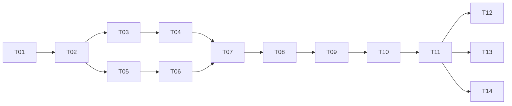

# LiteBeat Implementation Plan：实施路线与验收计划

> **For agentic workers:** 执行时使用 `superpowers:executing-plans`，逐任务落实并记录验收结果。下面的复选框用于未来执行跟踪，本次仅交付规划。

**Goal:** 在 `D:\LiteBeat` 实现能够扫描自托管音乐库、通过浏览器稳定播放并满足明确资源预算的音乐平台。

**Architecture:** Rust 模块化单体提供业务 API、受保护的媒体流和前端静态文件。SQLite 保存元数据与用户状态，音乐保留在文件系统；扫描使用有界后台协调器与临时受限子进程。

**Tech Stack:** Rust、Axum、Tokio、rusqlite/SQLite FTS5、Svelte 5、TypeScript、Vite、Vitest、Playwright。

**Spec:** [产品与前端体验](./01-product-and-experience.md)、[技术架构与性能设计](./02-architecture-and-performance.md)。实现前同时阅读两份约束，不只读取当前任务。

## Global Constraints

- 音乐来源已确认：扫描本机或服务器上的音乐文件，自托管音乐库。
- 生产运行不依赖 Node.js 服务，不引入 Redis、独立搜索服务或实时转码进程。
- 日常播放只有一个应用服务进程；扫描子进程、代理与页缓存必须纳入部署资源报告。
- SQLite 2 个读连接 + 1 个写连接，每连接 `cache_size=-2048`，`mmap_size=0`，写事务使用 `synchronous=FULL`。
- 普通 API 在途上限 32，全局媒体响应体上限 32，每会话媒体响应体上限 4，读取块 32 KiB。
- 分页默认 50、最大 100；播放队列最多 1000 个 ID；客户端详情缓存最多 100 首。
- ID 与文件大小在 JSON 中使用十进制字符串；时长与位置使用整数毫秒；时间使用 UTC RFC 3339。
- 目标：空库 RSS ≤24 MiB，使用后空闲 RSS ≤48 MiB，20 路混合播放 RSS 峰值 ≤96 MiB，维护场景主进程 RSS 峰值 ≤160 MiB。
- 标准播放场景部署 `memory.current` ≤256 MiB；浏览器 JS 堆 ≤40 MiB；所有数字均为待验证目标。
- 首屏 JS gzip 后 ≤80 KiB，初始 CSS gzip 后 ≤20 KiB；首屏 JS 计算所有立即加载的 chunk。
- P0 不包含公开注册、Web 上传、社区、推荐模型、跨设备队列同步或音频离线缓存。
- 本文列出的源码、脚本、测试和命令是实施时要创建或执行的内容，当前目录尚未实现这些功能。

---

## 1. 阶段、工期与依赖

按一名熟悉 Rust 和前端的开发者全职投入估算：P0 约 **23 个工作日 + 4–6 天机动**，即约 5–6 周。熟悉程度、真实媒体异常和跨平台适配可能改变工期；下面使用工作日，不承诺尚未确定的开始日期。

| 阶段 | 任务 | 估算 | 可检查的交付物 |
|---|---|---|---|
| M0 可运行基线 | T01 | 1 天 | 服务启动、静态首页、健康检查、空库内存记录 |
| M1 最小播放闭环 | T02–T04 | 5 天 | 数据库、认证、一首真实音频播放与拖动 |
| M2 可用音乐库 | T05–T06 | 5 天 | 增量扫描、专辑与歌曲分页、中文搜索 |
| M3 完整使用体验 | T07–T09 | 7 天 | 前端页面、稳定播放器、歌单、收藏、历史、移动端 |
| M4 性能与可运维发布 | T10–T11 | 5 天 | 真实基准、8 小时稳定性、发布包、恢复演练 |
| M5 可选增强 | T12–T14 | 5–8 天 | 缩略图、歌词、系统媒体键、离线兼容文件 |



默认按任务编号串行执行。依赖图用于识别接口边界，不要求增加人员或代理。每个任务交付后做一次范围集中的检查；真实行为测试用于关键逻辑，不为格式、静态文字或无行为的配置编写机械重复测试。

## 2. 目录与协作契约

完整源码结构在技术文档第 2 节。Rust workspace 的应用 package 和二进制统一命名为 `litebeat`，源码位于 `server/`。所有命令默认在项目根目录运行，前端通过 `npm --prefix web ...` 调用。

### 2.1 先冻结的数据契约

T01 创建 `web/src/lib/contracts.ts` 和对应 Rust DTO，后续任务不得自行重命名同一字段：

```ts
export type Id = string;
export type PlaybackState =
  | 'idle' | 'loading' | 'playing' | 'paused' | 'buffering' | 'error';

export interface TrackSummary {
  id: Id;
  title: string;
  artist: string;
  album_id: Id | null;
  duration_ms: number | null;
  available: boolean;
}

export interface Page<T> {
  items: T[];
  next_cursor: string | null;
  has_more: boolean;
}

export interface ApiError {
  error: { code: string; message: string; request_id: string };
}
```

契约样本存入 `fixtures/contracts/`。Rust 序列化测试与前端类型/请求测试使用同一批 JSON；不维护两套互相偏离的示例。API 完整路径以技术文档第 7 节为准。

### 2.2 每个任务的执行节奏

- [ ] 检查该任务依赖、已有文件和当前工作区变更，避免覆盖他人工作。
- [ ] 对有风险的行为先写下面指定的失败测试或协议样本，验证失败原因与目标一致。
- [ ] 完成当前任务的最小实现，不提前加入 P1/P2 功能。
- [ ] 运行指定检查，保存关键输出、失败原因和修复结论。
- [ ] 核对公共接口、资源上限与用户可见错误反馈。
- [ ] 如果项目已纳入 Git，做一个只包含本任务内容的本地提交；不自动推送或发布。

## 3. P0 实施任务

### T01：工程基线与可启动服务

**文件：** 创建根 `Cargo.toml`、`rust-toolchain.toml`、`server/Cargo.toml`、`server/src/{main,lib,config,error,http}.rs`、`web/package.json`、`web/src/{App.svelte,lib/contracts.ts}`、`config/litebeat.example.toml`、`.gitignore`、`server/tests/health.rs`。

**输入：** 本文全局约束。**输出：** `litebeat serve --config <file>`、健康检查、前端构建和统一错误 DTO。

- [ ] 选择兼容的稳定版本并冻结锁文件；确认 Windows MSVC 构建工具与 Node.js 可用。首次生成锁文件可使用安装命令，后续必须使用锁文件安装。
- [ ] 配置解析对端口 0、负容量、不存在的静态目录给出可读错误；数据目录首次启动可创建，音乐目录不可擅自创建。
- [ ] 实现 `/health/live` 与 `/health/ready`，端口默认 `127.0.0.1:8090`，日志省略敏感字段。
- [ ] 前端首页真实请求健康接口；生产加载 `web/dist`；API/媒体 404 保持 JSON/媒体错误，不回退应用 HTML。
- [ ] 写入版本清单、启动说明和一次 release 空库 RSS 基线。

配置样例至少包括：

```toml
[server]
bind = "127.0.0.1:8090"
web_dir = "web/dist"

[storage]
data_dir = "data"

[[library.roots]]
name = "local-music"
path = "D:/Music"

[limits]
api_inflight = 32
media_inflight = 32
media_per_session = 4
media_chunk_bytes = 32768
```

**验证：** `cargo test -p litebeat --test health`、`npm --prefix web run build`。测试包括 API 错误路由不返回 HTML、`HEAD` 健康检查无响应体。开发构建成功不替代 release 测量。

### T02：SQLite、迁移与有界工作队列

**文件：** 创建 `server/src/db/{mod,worker,migrate}.rs`、`server/migrations/001_core.sql`、`server/tests/db_contract.rs`。

**输入：** 配置、DTO。**输出：** 技术文档规定的表、2 读/1 写线程、迁移命令、参数化数据库命令边界。

- [ ] 为外键、重复路径、歌单条目重复曲目、事务回滚和 FTS 更新一致性写测试。
- [ ] 创建核心表与排序索引；事务中维护规范化字段及 FTS，验证 bundled SQLite 实际支持 FTS5/trigram。
- [ ] 每个连接应用并读取核对 PRAGMA；准备语句只在拥有连接的线程内使用。
- [ ] 建立有界读写队列，队满立即反馈；写命令超过 4 MiB 总排队载荷时拒绝继续入队。
- [ ] 为查询配置 progress handler；请求取消后，未开始的只读任务可以丢弃，写任务必须根据事务和幂等状态处理。
- [ ] 迁移失败不标记 ready；数据库版本高于当前程序支持范围时拒绝启动并给出恢复指导。

关键数据库断言示例：

```sql
-- 测试夹具初始化后必须返回 ok，且无外键错误行。
PRAGMA integrity_check;
PRAGMA foreign_key_check;
-- 测试迁移必须创建这三个前缀索引。
CREATE INDEX IF NOT EXISTS idx_tracks_title ON tracks(sort_title COLLATE NOCASE, id);
CREATE INDEX IF NOT EXISTS idx_tracks_artist ON tracks(sort_artist COLLATE NOCASE, id);
CREATE INDEX IF NOT EXISTS idx_tracks_album ON tracks(sort_album COLLATE NOCASE, id);
```

**验证：** `cargo test -p litebeat --test db_contract`。至少模拟一次写事务中途失败，确认主表、FTS、歌单关系没有部分提交。

### T03：管理员登录与会话

**文件：** 创建 `server/src/auth/{mod,password,session,csrf,rate_limit}.rs`、`server/tests/auth.rs`、`web/src/routes/Login.svelte`、`web/src/lib/api.ts`。

**输入：** users/sessions 表和有界数据库命令。**输出：** admin create CLI、login/session/logout 路由、前端鉴权请求包装。

- [ ] 先验证未登录访问曲目/媒体/歌单均失败；伪造 Origin、缺失 CSRF、过期 Cookie 被拒绝。
- [ ] CLI 交互建立管理员；Argon2id 参数 m=32 MiB、t=3、p=1；密码不进入命令行历史。
- [ ] 设置会话 Cookie、7 天绝对有效期、最多 64 会话与到期清理；HTTPS 和本机 HTTP 配置分开。
- [ ] 限流在密码校验前执行；校验并发 1、排队最多 2；限流键表有界。
- [ ] 登录成功返回前一页面，失败保留账号但清除密码字段；退出清除客户端音频和受保护缓存。

**验证：** `cargo test -p litebeat --test auth`。登录压力测试同时记录主进程 RSS 和合法用户响应，不通过降低哈希成本满足内存指标。

### T04：原文件播放与完整 Range 语义

**文件：** 创建 `server/src/media/{mod,path,stream,body_guard}.rs`、`server/tests/media_range.rs`、`fixtures/media/`、`web/src/lib/player/engine.ts`。

**输入：** 有效会话、测试曲目记录、受配置根目录约束的路径。**输出：** `GET/HEAD /media/tracks/{id}` 和最小浏览器播放页面。

- [ ] 用自生成短音频和已知字节文件建立测试夹具，记录 SHA-256 和媒体参数。
- [ ] 实现鉴权、路径验证、单范围传输、HEAD、多范围策略和不支持 If-Range 条件时完整返回。
- [ ] 用响应体包装器持有全局与会话流许可；正常结束、读取错误、客户端断开均释放。
- [ ] 为媒体配置 30s 无进展超时；普通 API 的总超时不能截断媒体响应。
- [ ] 用浏览器试听 MP3 和 AAC/M4A，拖动后确认播放位置正确；先建立基础兼容矩阵。

必须覆盖的协议向量：

```text
测试文件长度 = 10000 字节
无 Range                 -> 200，长度 10000
Range: bytes=0-0         -> 206，长度 1，Content-Range: bytes 0-0/10000
Range: bytes=100-199     -> 206，长度 100
Range: bytes=9000-       -> 206，长度 1000
Range: bytes=-100        -> 206，最后 100 字节
Range: bytes=10000-      -> 416，Content-Range: bytes */10000
Range: bytes=0-1,8-9     -> 200，长度 10000
HEAD + Range            -> 200，无响应体，完整 Content-Length
无 Cookie + 任意 Range  -> 401，不发送媒体字节
```

**验证：** `cargo test -p litebeat --test media_range`。额外测试 33 个不同会话的媒体响应中最多 32 个持有配额，超额 503；同一会话第 5 路返回 429。断开其中一路后新请求应立即可用。

### T05：受限扫描与增量入库

**文件：** 创建 `server/src/scanner/{mod,walk,coordinator,worker,protocol}.rs`、`server/tests/scanner.rs`、`fixtures/scanner/`。

**输入：** 根目录配置、数据库写入接口。**输出：** admin scans 创建/状态/取消端点、`litebeat scan-worker` 子命令。

- [ ] 建立缺标签、中文路径、损坏标签、超大图片标签、链接、无权限目录及扫描断开的夹具。
- [ ] 惰性遍历，按大小与 mtime 判定增量，未变文件不重新解析；提供 force 重读。
- [ ] 建立单子进程和有界 JSON 行协议，限制单条输入/输出长度，阻止损坏文件拖垮服务。
- [ ] 实现 Linux 子 cgroup、Windows Job Object 资源限制及退出清理；子进程超时 5s 可杀死并重建。
- [ ] 扫描成功才把未见条目标记不可用；取消/挂载盘掉线时保留原可用状态。
- [ ] 进度统计增量更新，错误明细最多 1000 条；服务重启将运行中任务标记 interrupted。

**验证：** `cargo test -p litebeat --test scanner`。相同目录重复扫描不增加条目；修改一首只更新对应条目；中途模拟根目录不可读不能让整库消失；扫描过程中已有 5 路播放继续工作。

### T06：歌曲、专辑、队列 ID 与中文搜索 API

**文件：** 创建 `server/src/library/{mod,query,cursor,normalize,search}.rs`、`server/tests/library_api.rs`、`scripts/seed-library.py`。

**输入：** 已扫描曲目、规范化字段与 FTS。**输出：** tracks/albums/search/queue-ids 端点及 `Page<TrackSummary>`。

- [ ] 先写同标题多首歌曲的翻页测试、过滤器与游标不匹配测试，以及非法 limit 测试。
- [ ] 实现游标分页，排序必须以 id 作为稳定次级键，规范化名称排序/比较与索引统一使用 NOCASE；不对每页执行全表 COUNT。
- [ ] 1–2 字符前缀查询使用普通索引，3 字符及以上使用字面 trigram 查询；验证 FTS 元字符安全处理。
- [ ] 搜索样本至少包含“周”“周杰”“周杰伦”、英文大小写、全角字符、引号、`%`、`_` 和不存在的名称。
- [ ] queue-ids 最多返回 1000 ID 与 truncated 标志；禁止借此一次读取全库详情。
- [ ] 创建可复现的 1 万/10 万条元数据造数脚本，数据种子固定，标题分布包含重复与中英文混合。

**验证：** `cargo test -p litebeat --test library_api`。保存 `EXPLAIN QUERY PLAN`，确认短查询命中预期索引；LIMIT 存在不代表查询一定避免了全表扫描。

### T07：前端应用外壳、音乐库与全局播放器

**文件：** 创建 `web/src/lib/{router.ts,player/state.ts,player/queue.ts}`、`web/src/lib/components/{AppShell,TrackList,AlbumGrid,PlayerBar,PlayerSheet,QueueDrawer,SearchBox,StatusPanel}.svelte`、首页/音乐库/专辑/搜索页面、`web/tests/player.test.ts`、`e2e/playback.spec.ts`。

**输入：** 已实现的登录、曲库和媒体 API。**输出：** 真实数据驱动的展示页面及单实例播放器。

- [ ] 建立一个音频引擎，其对外方法为 `load(track: TrackSummary): Promise<void>`、`play(): Promise<void>`、`pause(): void`、`seek(seconds: number): void`、`dispose(): void`。
- [ ] 状态类型使用本计划第 2 节契约；`load` 只选择媒体并准备状态，用户播放动作再触发 `play`，处理被浏览器拒绝的情况。
- [ ] 队列模块提供加入、下一首、移除、清空与最多 1000 项的上限检查；随机播放只打乱 ID，单曲循环不复制队列。
- [ ] 建立根布局与路由，使页面切换不重建音频元素；接入列表、专辑、搜索、空状态和错误状态。
- [ ] 搜索实现 composition、防抖、AbortController 和响应序号；刷新恢复队列和位置但不自动播放。
- [ ] 使用第一份文件的视觉初值和移动布局，首屏不加载管理页面或完整图标库。

端到端断言示例，T07 同时建立对应 `data-testid`：

```ts
import { test, expect } from '@playwright/test';

test('页面切换保留唯一播放器', async ({ page }) => {
  // Playwright 配置中的已登录夹具提供会话和两首测试曲目。
  await page.goto('/library');
  await page.getByTestId('track-play').first().click();
  await expect(page.getByTestId('player-state')).toHaveText('playing');
  await page.getByTestId('nav-albums').click();
  await expect(page.locator('audio')).toHaveCount(1);
  await expect(page.getByTestId('player-state')).toHaveText('playing');
});
```

**验证：** `npm --prefix web run test:unit -- tests/player.test.ts`、`npm --prefix web run test:e2e -- ../e2e/playback.spec.ts`。媒体能否真实解码和发声还需本机浏览器抽查，不能只依据 mock 状态断言。

### T08：收藏、歌单与历史闭环

**文件：** 创建 `server/src/playlists/{mod,repo,routes}.rs`、`server/src/history/{mod,repo,routes}.rs`、`server/tests/user_library.rs`，新增收藏/歌单页面、`web/tests/playlist.test.ts`、`e2e/user-library.spec.ts`。

**输入：** owner_id、曲目 ID、现有会话及数据库写线程。**输出：** 收藏、歌单、历史 API 与页面。

- [ ] 验证收藏 PUT/DELETE 幂等，歌单重复曲目使用不同条目 ID；不存在歌曲、超长名称和超量条目被拒绝。
- [ ] 实现歌单 version/ETag/If-Match，缺失条件返回 428，重排时检查完整条目集合；并发修改返回 409 并提示刷新。
- [ ] 创建类操作使用 request_dedup；相同 key 与相同请求重试返回原结果，不同内容复用 key 返回 409。
- [ ] 前端乐观更新失败时回滚状态，写操作不能无限自动重试；断线恢复不重复追加歌曲。
- [ ] 播放满 30s 或短曲播放结束上报一次 event_id，服务端去重并裁剪到每用户 500 条；跳播 1 秒不记为已播放。
- [ ] 完成刷新及服务重启后的数据恢复验收，删除歌单不删除歌曲文件。

**验证：** `cargo test -p litebeat --test user_library` 和 `npm --prefix web run test:e2e -- ../e2e/user-library.spec.ts`。构造“服务端已提交但客户端没收到响应”的重试，验证没有重复歌单或条目。

### T09：移动端、可访问性与资源生命周期

**文件：** 完善 `web/src/styles/`、播放器与页面组件，创建 `e2e/responsive.spec.ts`、`e2e/lifecycle.spec.ts`、`web/tests/search.test.ts`。

**输入：** 完整 P0 使用流程。**输出：** 桌面/移动交互、错误恢复、可证明的事件与缓存清理。

- [ ] 在 360、390、768、1024、1440 CSS px 宽度检查布局、横屏、软键盘和安全区域。
- [ ] 键盘可操作全部核心按钮；滑块支持箭头键；输入框中不触发全局空格播放快捷键。
- [ ] 焦点进入并退出队列抽屉可恢复；按钮有可访问名称；歌词和状态不造成连续屏幕阅读器播报。
- [ ] 测试连续 50 次导航、100 次切歌、搜索请求乱序、登录失效与网络断开。
- [ ] 校验 DOM 中一个 audio、仅一组音频事件监听；详情缓存≤100，结果缓存≤3 页；隐藏页面关闭无意义轮询。
- [ ] 检查浅色/深色主题、减少动态效果、空库和错误状态截图。

**验证：** `npm --prefix web run test:e2e -- ../e2e/responsive.spec.ts ../e2e/lifecycle.spec.ts`。Chromium、Firefox、WebKit 自动化加实际 Safari/iOS、Chrome/Android 抽查；记录具体浏览器版本与音频编码样本。

### T10：性能预算、压力与长稳验证

**文件：** 创建 `scripts/{check-bundle.mjs,load-media.py,load-api.py,sample-memory.py}`、`server/tests/limits.rs`、`web/tests/cache-limits.test.ts`；生成 `reports/baseline/` 中的 CSV/JSON/图表。

**输入：** release 应用、固定数据集和单独负载机。**输出：** 本文第 4–6 节的实际测量报告、每个指标的达标结论与偏差分析。

- [ ] 用小容量可注入配置测试队列满、媒体配额、登录配额、缓存裁剪和客户端取消，验证资源有上限。
- [ ] 构建产物审计统计首屏所有入口依赖、CSS、图片和字体；不能只统计入口 JS 文件。
- [ ] 执行空库、热库、20 路混合播放、扫描、登录、超载及慢客户端场景。
- [ ] 对持续增长对象做堆/分配与文件句柄分析；不以手动强制 GC 或定时重启作为达标办法。
- [ ] 修复明确瓶颈后只重跑受影响场景和相关回归，再进行一次完整 8 小时稳定性测试。
- [ ] 指标不达标时记录实际值、原因与下一项修改，不把目标数字复制成测试结果。

**验证：** `cargo test -p litebeat --test limits`、`npm --prefix web run test:unit -- tests/cache-limits.test.ts`、`node scripts/check-bundle.mjs web/dist`，并执行第 5 节定义的工作负载。

### T11：发布、备份恢复与运行说明

**文件：** 创建 `server/src/maintenance/{mod,backup,restore}.rs`、`server/tests/backup_restore.rs`、`deploy/litebeat.service`、`deploy/Dockerfile`（可选）、`deploy/windows.md`、`README.md`、`.github/workflows/ci.yml`（使用 GitHub 时）。

**输入：** 通过功能与性能门槛的发布候选。**输出：** Windows/Linux 发布包、升级/回滚/恢复流程、完整验收记录。

- [ ] 定义 CLI：`litebeat backup --output <file>` 使用 Backup API 创建快照；`litebeat restore --input <file> --data-dir <empty-dir>` 离线恢复到空目录，拒绝覆盖已有数据。
- [ ] 打包可执行文件、静态资源、配置示例与版本清单；排除源码音乐、密码、日志和本机配置。
- [ ] Linux 以非 root 用户运行，音乐目录只读，限制进程内存与文件权限；Windows 服务/启动脚本行为有说明。
- [ ] 在全新目录安装一次；关闭开发服务后确认全部页面、API、音频都由发布服务提供。
- [ ] 创建歌单与收藏后在线备份，在新目录恢复，执行数据库完整性检查、登录、搜索、播放和歌单校验。
- [ ] 演练失败迁移恢复；说明应用回退时数据库必须匹配备份版本，不能简单覆盖旧可执行文件。
- [ ] 整理 README：配置、启动、扫描、支持格式、资源报告、备份、恢复、常见错误和已知限制。

**验证：** `cargo test -p litebeat --test backup_restore`，Windows/Linux 发布包各完成一次新安装与恢复。签发发布结论前核对第 7 节清单。

## 4. 数据集与标准测量环境

### 4.1 基准设备

| 维度 | 标准要求 |
|---|---|
| 服务端 | Linux x86_64，2 vCPU，2 GiB 主机内存，本地 SSD |
| 应用限制 | 独立 cgroup，`memory.max=256 MiB`、无 swap；负载脚本和浏览器不在该组 |
| 网络 | 服务端与负载端有线局域网，空载 RTT ≤5ms，链路吞吐不成为 20 路 MP3 瓶颈 |
| 生产构建 | `cargo build --release --locked`，锁定前端依赖后生成静态产物 |
| 浏览器 | 无扩展的新用户配置；记录操作系统、浏览器版本、屏幕和设备 |
| Windows 对照 | 同等核心与内存下测 Working Set 和 Private Bytes，分别报告，不直接与 Linux RSS 混算 |

如果当前机器不满足条件，可以做本地开发测量，但必须标为“本地观察”，不能冒充标准基准。

### 4.2 数据集

- **D0 空库**：只有管理员和必要表，用于启动基线。
- **D1 小型真实库**：100 首短音频、至少 10 张专辑，混合 MP3、AAC/M4A、FLAC、Ogg/Opus 和异常文件；记录每种编码的参数。
- **D2 规模元数据**：1 万与 10 万条自生成记录，中英文各有覆盖、包含同名曲目，固定随机种子。只用于数据库与展示压测，不代替媒体扫描测试。
- **D3 播放样本**：至少 20 个不同的 320 kbit/s MP3 文件，每个至少 5 分钟，避免全部读同一个缓存热点。
- **D4 扫描目录**：一份至少 1 万个可解析文件的真实目录树，文件和目录数量、总大小、格式分布记录在清单里；额外复制样本可使用，但必须说明内容重复度。
- **D5 异常集**：超大标签、损坏图片、链接逃逸、长路径、无权限、零字节文件、格式与扩展名不一致、目录访问中断。

媒体使用自生成音频或可再分发样本，记录来源与哈希。大量元数据行不能证明真实十万文件扫描速度；没有对应实测时如实保留容量结论的适用范围。

## 5. 负载方案与测量步骤

### 5.1 场景表

| 场景 | 操作 | 时间与采样 | 主要判定 |
|---|---|---|---|
| B0 启动空闲 | D0，release 启动后不操作 | 稳定 60s 后，每秒采样 5 分钟 | RSS 最大值 ≤24 MiB |
| B1 使用后空闲 | D2，登录并浏览 100 页、执行 100 次搜索后停止请求 | 空闲 5 分钟，取最后一分钟最大值 | RSS ≤48 MiB，报告 allocator 保留 |
| B2 标准混合 | 20 路 D3 播放 + 50 RPS API | 预热 5 分钟、测量 15 分钟，重复 3 次 | RSS ≤96 MiB，整组内存 ≤256 MiB，延迟达标 |
| B3 首播与拖动 | D1/D3，浏览器真实播放，冷/热缓存分开 | 首播与拖动各至少 100 次 | 首播 p95≤800ms，拖动 p95≤500ms |
| B4 扫描干扰 | 5 路播放时首次扫描 D4，随后增量扫描 | 全过程采样主/子进程和整组内存 | 主进程 RSS≤160 MiB，无服务崩溃；播放稳定，报告扫描吞吐 |
| B5 登录干扰 | 播放期间合法登录及错误密码请求 | 10 分钟 | 哈希并发≤1，有界拒绝，主进程 RSS≤160 MiB |
| B6 超载与慢客户端 | 64 路媒体请求、突发 200 RPS、慢读和随机断开 | 10 分钟 | 超额 429/503 可解释，内存有界，负载恢复后服务可用 |
| B7 长时间运行 | 5 路播放，每分钟切歌和导航，穿插搜索及一次增量扫描 | 8 小时 | 无持续内存增长、无句柄/监听器泄漏、无数据损坏 |

标准 20 路播放使用 20 个独立会话，避免触发每会话 4 路限制；不是把同一会话的 20 个拒绝响应算作成功并发播放。

API 混合比例为列表 60%、搜索 20%、专辑 10%、收藏/歌单写入 10%。固定请求速率、请求总数、错误数、客户端排队时间和服务端延迟同时记录；压测端未发出的请求不得被静默丢弃。

20 × 320 kbit/s = 6.4 Mbit/s，约 0.8 MB/s 的音频有效载荷，不含协议开销。压力脚本按每路约 40,000 字节/秒持续读取并周期性发 Range 请求，同时另测无节流下载峰值；不能把瞬间下载完整文件误称为持续 20 路播放。高码率无损音频独立列场景，不能套用 MP3 的吞吐结果。

### 5.2 前端测量

1. 以发布构建和新浏览器配置打开首页，记录从 navigationStart 到 LCP。模拟下载 10 Mbit/s、RTT 100ms、CPU 4 倍降速；固定相同机器，重复 5 次，以中位数报告。
2. 首屏传输包括 HTML、所有立即执行的 JS chunk、CSS、初始图片与字体；音频仅在用户点击后开始，不纳入首页预算。
3. LCP≤2s、CLS≤0.1 是实验室目标。若有真实用户数据，再报告交互延迟分布，不能把一次实验室结果当现场 INP。
4. 播放并浏览 30 分钟，测 JS 堆≤40 MiB；同时记录浏览器进程内存和系统总增量。正常运行验收不手动触发 GC。
5. 堆快照可以作为诊断工具；若为比较快照主动 GC，单独标注诊断操作，不与正常运行内存混在一起。
6. 连续浏览 50 页后离开，检查 detached DOM、监听器、定时器与缓存对象。DOM/缓存应回到稳定范围。

### 5.3 长稳统计

前 30 分钟作为预热与分配器适应期。后续每 15 分钟取同类负载窗口中位数，要求末小时相对首个稳定小时 RSS 增量不超过 8 MiB，且没有持续正向增长趋势；浏览器 JS 堆同法对比，增量不超过 5 MiB。扫描窗口单独标记，不用扫描峰值与空闲基线直接相减判定泄漏。

主机重启后的冷缓存与应用重启后的热缓存分开记录；冷缓存准备仅在专用测试环境进行，不对用户日常机器强制清除系统缓存。整个测试过程记录 `memory.events` 的 oom/oom_kill 增量及服务重启次数：验收要求均为 0，不能把达到硬限制后被杀死的进程算作内存达标。

### 5.4 结果文件格式

`scripts/sample-memory.py` 输出至少包括：

```text
timestamp,scenario,main_rss_bytes,worker_rss_bytes,cgroup_memory_bytes,
cgroup_anon_bytes,cgroup_file_bytes,open_fds,active_streams,db_read_queue,
db_write_queue,cpu_percent
```

负载结果包含请求数、完成数、非预期错误率、p50/p95/p99、传输字节、拒绝原因。B2 非预期错误率要求 <0.1%，且无媒体字节校验错误；B6 的设计内拒绝单独统计，不能混入“全部成功”。

报告需记录提交标识或源码快照哈希、构建选项、完整依赖版本、配置、数据集哈希、机器和操作系统、是否经过 TLS 代理。每次 B2 报告三轮原始结果与中位数，同时检查每轮峰值，不能只挑最好一轮。

## 6. 工程检查与执行命令

以下命令在对应任务创建文件后执行，当前文档生成不运行尚不存在的应用测试。

```powershell
# 项目根目录，依赖锁文件已在 T01 建立。
cargo fmt --all -- --check
cargo clippy --workspace --all-targets --locked -- -D warnings
cargo test --workspace --locked
cargo build --release --locked
npm --prefix web ci
npm --prefix web run check
npm --prefix web run test:unit
npm --prefix web run build
npm --prefix web run test:e2e
node scripts/check-bundle.mjs web/dist
```

T01/T07 创建 npm scripts：`check` 运行 Svelte/TypeScript 检查，`test:unit` 运行 Vitest，`test:e2e` 运行 Playwright。Playwright 使用独立临时数据目录与测试配置，`testDir` 指向根目录 `e2e/`，不复用管理员真实音乐库。

每次变更先运行影响范围内的测试。完整功能、构建和跨平台检查在里程碑收尾运行；依赖升级、流协议或数据库迁移变化必须重跑相关协议/恢复测试。没有实际执行记录就不能写“通过”。

## 7. 发布验收清单

- [ ] 所有 P0 用户故事 U01–U08 有可追溯的实现和验证证据。
- [ ] 新安装可独立运行，Node.js/Vite 开发服务关闭后仍能浏览与播放。
- [ ] 登录、CSRF、媒体权限、路径边界和 Cookie 失效测试通过。
- [ ] 正常/损坏/缺失/不兼容媒体具有明确用户反馈。
- [ ] Range、HEAD、客户端取消、配额持有与释放经过协议测试。
- [ ] 中文短查询、长查询、特殊字符与分页边界符合文档规则。
- [ ] 收藏、歌单、历史经过服务重启、并发写入、幂等重试验证。
- [ ] 移动端、键盘、屏幕阅读器基本路径和真实浏览器格式兼容矩阵完成。
- [ ] B0–B7 有实际报告；未达指标有明确偏差，不能直接宣称满足低内存目标。
- [ ] 前端体积检查与 30 分钟内存测试通过，8 小时运行无持续增长。
- [ ] 备份恢复和迁移失败回滚演练完成；音乐原文件未被修改或删除。
- [ ] 日志、配置、发布包不包含会话、密码或用户媒体内容。
- [ ] README 中的限制与当前发布能力一致，P1/P2 未完成项不写成现有功能。

## 8. 可选增强任务

### T12：封面缩略图

**文件：** `server/src/media/artwork.rs`、`server/tests/artwork.rs`、`web/src/lib/components/CoverImage.svelte`。依赖 T05、T11。

- [ ] 在受限子进程处理目录封面，先检查输入字节和解码尺寸限制；恶意图片失败不影响服务。
- [ ] 生成 96/320px 图片与源版本索引，达到 512 MiB 磁盘配额后按规则清理。
- [ ] 验证图片加载失败、重复请求合并、缓存淘汰、源图片更新、移动端低分辨率选用。
- [ ] 重跑首屏传输和 B4 扫描干扰，禁止用大原图替代缩略图规避实现。

### T13：歌词与系统媒体控制

**文件：** `server/src/media/lyrics.rs`、`server/tests/lyrics.rs`、`web/src/lib/player/media-session.ts`、`web/src/lib/components/LyricsPanel.svelte`。依赖 T07、T11。

- [ ] 解析有界 UTF-8 LRC，覆盖多时间戳、乱序、重复行、无时间戳和错误编码。
- [ ] 根据当前播放位置二分定位歌词；仅更新相邻高亮行，不每帧重渲染整个歌词列表。
- [ ] 接入 Media Session 功能探测、元数据和操作处理；卸载时清理处理器。
- [ ] 在支持的平台验证媒体键与锁屏信息；不支持的平台基础播放器保持可用。

### T14：离线兼容副本

**文件：** `server/src/maintenance/convert.rs`、`server/tests/convert.rs`、`config/convert.example.toml`。依赖 T04、T11。

- [ ] 显式 CLI 执行 FFmpeg，按参数数组启动，不拼接 shell 命令；一次只处理一个文件。
- [ ] 设置独立维护预算，记录峰值；不把 FFmpeg 内存从整机报告中遗漏。
- [ ] 生成 AAC-LC/M4A 兼容副本，校验时长和可播放性，成功后原子提交索引。
- [ ] 测试输入损坏、磁盘满、任务取消、重复执行及程序崩溃后临时文件清理；不覆盖原始音频。
- [ ] 浏览器只选择已存在的兼容副本，不因不支持某格式自动触发在线转换。

## 9. 风险、停止条件与决策记录

| 风险 | 最早发现阶段 | 应对与决策条件 |
|---|---|---|
| Rust/跨平台构建拖慢交付 | M0 | 先验证完整工具链和最小流服务；若团队成本明显不匹配，用相同基准评估 Go 备选 |
| 24/48 MiB 目标过紧 | M0/M1 | 分析线程、SQLite、哈希与分配器保留；调整设计后再测，不削弱认证 |
| 扫描解析异常峰值 | M2 | 子进程限制、超时、重启和单文件隔离；不一次并发处理全目录 |
| 中文短查询结果或性能不符合预期 | M2 | 明确前缀规则，验证实际索引；需要任意两字片段时单独设计二元索引 |
| 浏览器格式/自动播放差异 | M1/M3 | 早期真实设备验证；反馈可理解，兼容副本进入 P1 |
| 歌单重试导致重复数据 | M3 | 幂等记录与写事务一致；模拟已提交但丢响应 |
| SQLite WAL 或磁盘增长 | M2/M4 | 短事务、检查点观察、错误/历史/备份保留上限 |
| 内存预算被代理/子进程隐藏 | M4 | 进程、进程树和 cgroup 同时报表 |
| 恢复流程只停留在文档 | M4 | 必须新目录恢复并重新播放后才满足发布门槛 |

后续新增依赖、常驻服务或提升资源上限，在技术文档中补充：触发问题、实测证据、备选方案、前后内存/延迟变化、维护代价。不能仅凭“以后可能需要”扩大架构。

## 10. 本轮交付与下一步

本轮交付是项目根目录中的三份 Markdown 规划。第一项实施工作是 T01，第一项关键可行性验证是 T04 的真实音频 Range 播放。完成这两项后即可用证据检查技术栈和资源目标，再继续完善音乐库与前端体验。
